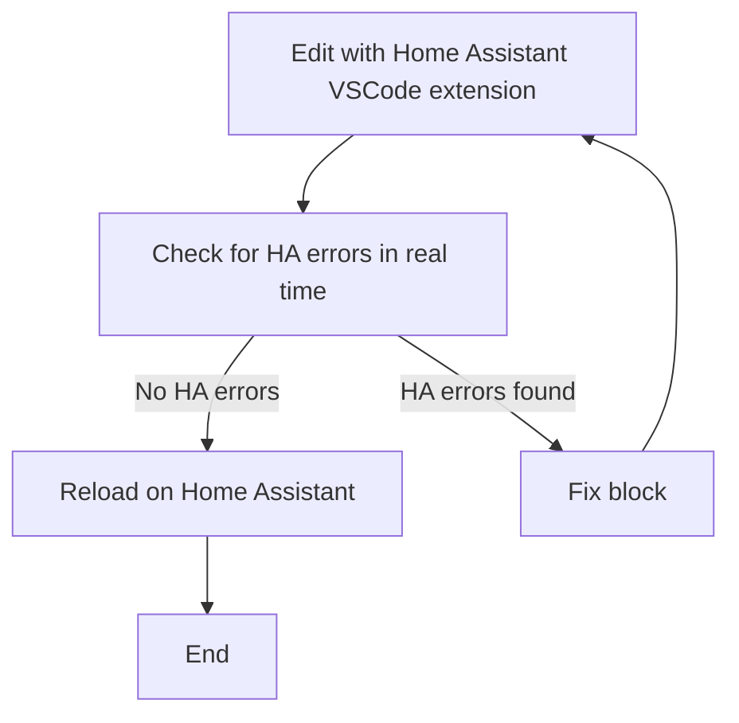

# yaml fixes

## Home Assistant YAML: What is a "HA error"?

**Recommended tool:**
Use the official Home Assistant VSCode extension for editing and validating your YAML files. It provides real-time linting, entity/service autocomplete, and detects HA-specific errors that yamllint cannot. Use yamllint only as a secondary check for general YAML syntax.

**HA errors:**
These are YAML errors that prevent Home Assistant from loading/parsing the file or automation. They must always be fixed.

1. **Wrong indentation** (`wrong indentation`)
   - Example: Expected 4 spaces, but found 2.
   - Symptom: Automation does not load or the whole configuration fails.
2. **Syntax error** (`syntax error`)
   - Example: "expected <block end>, but found '-'"
   - Symptom: Home Assistant rejects the file.
3. **Duplicate keys** (`duplication of key`)
   - Example: Two `alias:` or two `trigger:` in the same block.
   - Symptom: Only one value is read, the rest is ignored or causes an error.
4. **Invalid structure** (e.g., nested automations, badly formatted lists)
   - Symptom: Automation is ignored or parsing error.

**YAML errors that are NOT HA errors (Home Assistant accepts):**
These errors/warnings may appear in yamllint, but do not prevent Home Assistant from working:

1. **Long line** (`line too long`)
   - Example: "line too long (88 > 80 characters)"
   - Symptom: None. Style only.
2. **Missing '---' at the start** (`missing document start`)
   - Symptom: Home Assistant accepts it normally.
3. **Trailing spaces** (`trailing-spaces`)
   - Symptom: None.
4. **Non-standard comments**
   - Symptom: None.

**Best practices summary:**

**How to reload automations.yaml in Home Assistant via curl:**

After editing and saving automations.yaml, you can reload automations without restarting Home Assistant using the API:

```sh
curl -s -H "Authorization: Bearer $HA_TOKEN" -H "Content-Type: application/json" -X POST -d '{}' http://<HA_IP>:8123/api/services/automation/reload
```

Replace `<HA_IP>` with your Home Assistant server IP. This is equivalent to clicking "Reload Automations" in the UI and will apply your YAML changes immediately.

**Recommended YAML cleaning flow:**



**New best practices from the process:**

- Prefer editing and validating with the Home Assistant VSCode extension.
- Always edit in small blocks and validate at each step.
- Never proceed if the number of errors increases after an edit.
- Document DOs and DON'Ts learned during cleaning.
- Prioritize errors that break Home Assistant, be tolerant with style warnings.

**Recent findings:**

- Trailing spaces, extra blank lines, and non-standard comments do not affect Home Assistant operation, but can be removed to keep YAML cleaner and more readable.

_Findings based on real cleaning of automations.yaml and validation with yamllint + Home Assistant._

```

```
